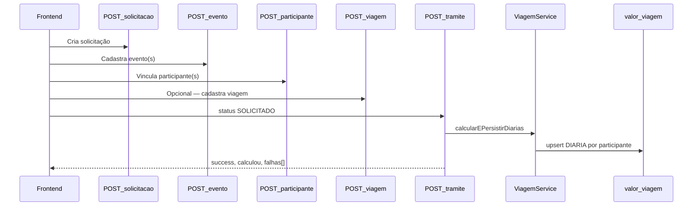

# Cadastro da Solicitação e Cálculo de Diárias

Documento técnico do backend **diarias-beckend**, descrevendo o fluxo de cadastro de uma solicitação de diárias e o momento em que os valores são calculados e persistidos.

---

## 1. Visão geral

O sistema separa **cadastro** (montagem da solicitação) de **formalização** (trâmite com status `SOLICITADO`), que dispara o cálculo automático de diárias.



**Ponto-chave:** o cálculo **não** ocorre em `POST /solicitacao`. Ele ocorre no **primeiro trâmite** criado com `status = SOLICITADO` (`POST /tramite/0/:nome`), ou manualmente via `POST /tramite/recalcular-diarias/:solicitacaoId`.

---

## 2. Modelo de dados

Entidades principais (`prisma/schema.prisma`):

| Entidade | Papel |
|----------|-------|
| `solicitacao` | Cabeçalho (responsável, lotação, login). Status inicial `NAO` na criação. |
| `evento` | Evento da solicitação: datas, `exterior` (SIM/NAO), `tem_passagem`, `pais_id`, `cidade_id`. |
| `participante` | Servidor ou colaborador (CPF, cargo, tipo S/C/T, conta bancária). |
| `evento_participantes` | Vínculo evento ↔ participante. |
| `viagem` | Deslocamento: origem/destino, datas, `exterior`, `pais_id`, `solicitacao_id`. |
| `viagem_participantes` | Vínculo `evento_participantes` ↔ `viagem`. |
| `valor_viagem` | Valores calculados: `tipo` (DIARIA/PASSAGEM), `destino` (NACIONAL/INTERNACIONAL), `cotacao_dolar`. |
| `cargo_diarias` + `valor_diarias` | Valores unitários por cargo: `dentro`, `fora`, `internacional`. |
| `tramite` | Movimentação do workflow; gatilho do cálculo quando `status = SOLICITADO`. |

Relacionamento simplificado:

```
solicitacao
  └── evento
        └── evento_participantes
              ├── participante
              └── viagem_participantes
                    └── viagem
                          └── valor_viagem (DIARIA / PASSAGEM)
```

---

## 3. Fase 1 — Cadastro da solicitação

Ordem típica de chamadas pelo frontend:

### 3.1 Criar solicitação

**`POST /solicitacao`**

- Arquivo: `src/solicitacao/solicitacao.controller.ts`
- Cria registro em `solicitacao` com `status: 'NAO'`
- Registra log de auditoria (`LogSistemaService`)

Exemplo de body (campos principais):

```json
{
  "cpf_responsavel": "12345678901",
  "nome_responsavel": "Fulano da Silva",
  "cod_lotacao": 10,
  "lotacao": "DAINF",
  "login": "fulano.silva"
}
```

### 3.2 Cadastrar evento(s)

**`POST /evento`**

- Arquivo: `src/evento/evento.controller.ts`
- Vincula evento à `solicitacao_id`

Campos relevantes para diária:

| Campo | Valores | Efeito no cálculo |
|-------|---------|-------------------|
| `exterior` | SIM / NAO | SIM → fluxo internacional (USD + cotação) |
| `tem_passagem` | SIM / NAO | SIM → valor `fora` (nacional) ou diária extra no internacional |
| `inicio`, `fim` | DateTime | Período do evento; base para contagem de dias |
| `cidade_id` | number ou 0 | 0 → `null` (evento internacional) |
| `pais_id` | number | Obrigatório; usado na viagem mínima automática |

### 3.3 Vincular participante(s)

**`POST /participante/evento/:idEvento`**

- Arquivo: `src/participante/participante.controller.ts`
- Cria/atualiza `participante` e vínculo `evento_participantes`
- Persiste conta bancária via `ParticipanteService.create` (upsert em `conta_diaria`)

Exemplo (servidor com conta):

```json
{
  "nome": "WENDELL MIRANDA SACRAMENTO",
  "cpf": "71021086215",
  "matricula": 918,
  "cargo": "CHEFE DE DIVISÃO",
  "tipo": "S",
  "data_nascimento": "1981-07-20",
  "conta_diaria": [{
    "nome": "WENDELL MIRANDA SACRAMENTO",
    "cpf": "71021086215",
    "tipo": "S",
    "tipo_conta": "C",
    "agencia": "3851-2",
    "conta": "18288-5",
    "banco_id": 1,
    "participante_id": 0
  }]
}
```

### 3.4 Cadastrar viagem (opcional)

**`POST /viagem/evento_participantes/:id`**

- Arquivo: `src/viagem/viagem.controller.ts`
- `:id` = ID de `evento_participantes`
- Cria `viagem` + `viagem_participantes`

Usado quando há deslocamento/passagem explícita (aeroporto, datas de ida/volta, etc.).

**Sem viagem cadastrada:** no cálculo, o backend cria automaticamente uma viagem mínima via `ensureViagemMinima` (datas = início/fim do evento), pois `valor_viagem.viagem_id` é obrigatório.

### 3.5 Etapas paralelas (sem cálculo de diária)

- Anexos de evento (`anexo_evento`)
- Condutores da solicitação
- Valores de passagem (`valor_viagem` com `tipo = PASSAGEM`)
- Correções, empenhos, protocolo e-TCE

Essas etapas não disparam o cálculo de diária.

---

## 4. Fase 2 — Formalização (trâmite)

### 4.1 Endpoint principal

**`POST /tramite/:id/:nome`**

- Arquivo: `src/tramite/tramite.controller.ts`
- `:id = 0` → cria trâmite; `:id > 0` → atualiza trâmite existente
- `:nome` = usuário responsável pelo trâmite

| Condição | Comportamento |
|----------|---------------|
| `id > 0` | Atualiza trâmite. **Não recalcula** diária. |
| `id = 0` + `status !== SOLICITADO` | Cria trâmite. **Não calcula** diária. |
| `id = 0` + `status = SOLICITADO` | Cria trâmite + **`calcularEPersistirDiarias`**. |

### 4.2 Resposta do trâmite

```json
{
  "success": true,
  "calculou": true,
  "total": 3,
  "elegiveis": 3,
  "falhas": [
    {
      "participanteId": 42,
      "nome": "FULANO DE TAL",
      "motivo": "Valor de diária não encontrado para o cargo do participante"
    }
  ]
}
```

| Campo | Significado |
|-------|-------------|
| `success` | Trâmite criado/atualizado com sucesso |
| `calculou` | `true` somente se **todos** os elegíveis tiveram diária salva e `total > 0` |
| `total` | Quantidade de participantes com diária persistida |
| `elegiveis` | Total de participantes processados |
| `falhas` | Lista de erros por participante (trâmite **permanece** salvo) |

### 4.3 Recálculo manual

**`POST /tramite/recalcular-diarias/:solicitacaoId`**

- Executa a mesma lógica de `calcularEPersistirDiarias` sem criar trâmite
- Útil para corrigir participantes que falharam (`falhas[]`)

---

## 5. Fase 3 — Orquestração do cálculo

Método central: **`ViagemService.calcularEPersistirDiarias`**

Arquivo: `src/viagem/viagem.service.ts`

```
1. calculaDiasParaDiaria(solicitacaoId)     → lista participantes elegíveis
2. Para cada participante:
   a. ensureViagemMinima (se viagem_id = 0)
   b. calculaDiaria(viagemId, participanteId, eventoId, totalDias, solicitacaoId)
3. Promise.allSettled                        → falhas isoladas por participante
4. Retorna { total, elegiveis, calculou, falhas }
```

---

## 6. Contagem de dias

Método: **`calculaDiasParaDiaria`**

1. Busca todos os `evento` da solicitação com `evento_participantes` e viagens
2. **Inclui participantes sem viagem** (usa `evento.inicio` como data de referência)
3. Agrupa por CPF do participante
4. Agrupa eventos contínuos: se o gap entre fim de um evento e início do próximo for ≤ 1 dia, considera o mesmo grupo
5. Soma dias com `Util.totalDeDias(inicio, fim)` — diferença em dias **sem +1**
6. Retorna por participante:

```typescript
{
  participante,
  totalDias,
  evento,              // primeiro evento do grupo
  viagem,              // viagem_id (0 se ausente)
  eventoParticipanteId // ID de evento_participantes
}
```

### Viagem mínima automática

Método: **`ensureViagemMinima`**

Quando `viagem_id = 0`:

1. Verifica se já existe `viagem_participantes` para o `evento_participantes_id`
2. Se não, cria `viagem` com:
   - `data_ida = evento.inicio`
   - `data_volta = evento.fim`
   - `pais_id`, `exterior`, `local_exterior`, `cidade_destino_id` do evento
   - `solicitacao_id`
3. Cria vínculo `viagem_participantes`

---

## 7. Cálculo por tipo de evento

Método: **`calculaDiaria`**

A decisão usa `evento.exterior` do evento analisado (`getEventosParticipante`).

### 7a. Nacional (`exterior = NAO`)

1. Chama `SolicitacaoService.getEventosParticipante(solicitacaoId, participanteId)`
2. `processEventosParticipante` calcula `valor_diaria` agregado:
   - Conta **dias únicos** de calendário (inclusive) em todos os eventos do participante
   - Busca valores em `cargo_diarias` / `valor_diarias` pelo cargo
   - Aplica `calculaValoresMelhorado`:

| Prioridade | Condição | Valor unitário/dia |
|------------|----------|-------------------|
| 1 | `exterior = SIM` | `internacional` |
| 2 | `tem_passagem = SIM` | `fora` |
| 3 | demais | `dentro` |

**Fórmula:**

```
valor_diaria = (valorPorDia × totalDiasUnicos) + (valorPorDia / 2)
```

A meia diária é adicionada **uma vez** ao total.

3. Persiste em `valor_viagem`:
   - `tipo = DIARIA`
   - `destino = NACIONAL`
   - `valor_individual = valor_diaria`
   - `participante_id`

4. Idempotência: `ValorViagemService.upsertDiaria` — atualiza se já existir registro para `(viagem_id, participante_id, destino)`.

### 7b. Internacional (`exterior = SIM`)

1. Chama `calculaInternacional` → `destinoInternacional`
2. **`consultaCargo(participanteId)`**:
   - Busca participante no banco
   - Se `efetivo = SERVIDORES EFETIVOS` e `funcao` preenchida → usa `funcao` como cargo
   - Lança erro se cargo ausente
3. Busca valores em `cargo_diarias` / `valor_diarias`
4. **Cálculo em USD** (`CalculoInternacional.servidores`):

```
totalUSD = totalDias × valor_internacional + 1
```

(+1 por regra de arredondamento/ajuste no código; valor `internacional` está em dólar)

5. **Conversão USD → BRL**:
   - Prioridade: cotação PTAX do Banco Central (`cotacaoVenda`)
   - Fallback: AwesomeAPI (`USDBRL.bid`)
   - `valorBRL = totalUSD × cotação` (arredondado 2 casas)

6. Persiste diária internacional:
   - `tipo = DIARIA`, `destino = INTERNACIONAL`
   - `valor_individual` = valor em **reais**
   - `cotacao_dolar` = cotação usada
   - `justificativa` = `"USD X.XX × cotação Y.YYYY"`

7. Se `tem_passagem = SIM`, persiste diária adicional:
   - `destino = NACIONAL`
   - `valor_individual` = valor `fora` (dia de deslocamento)

---

## 8. APIs auxiliares

| Endpoint | Uso |
|----------|-----|
| `GET /valor_diarias/cotacao/bc/dolar` | Cotação PTAX (BC) |
| `GET /valor_diarias/cotacao/dolar` | Cotação AwesomeAPI |
| `GET /solicitacao/eventos/solicitacao/:solicitacao_id/participante/:participante_id` | Prévia/análise de diárias por participante |
| `GET /viagem/simula/agrupamento/:id` | Simula `calculaDiasParaDiaria` (id = solicitacao_id) |
| `GET /valor_viagem/solicitacao/:id/participantes-diarias` | Lista diárias já salvas |

---

## 9. Troubleshooting

| Sintoma | Causa provável | Ação |
|---------|----------------|------|
| `calculou: false`, `elegiveis: 0` | Solicitação sem eventos ou participantes | Verificar cadastro de evento e participante |
| `falhas`: cargo não encontrado | Cargo ausente em `cargo_diarias` | Cadastrar valores para o cargo em `valor_diarias` / `cargo_diarias` |
| `falhas`: participante sem cargo | Campo `cargo` vazio no participante | Preencher cargo no cadastro |
| `falhas`: cotação indisponível | APIs BC/AwesomeAPI fora do ar | Tentar recálculo depois; verificar conectividade |
| Diária não recalculada | `POST /tramite/:id/:nome` com `id > 0` | Usar `POST /tramite/recalcular-diarias/:solicitacaoId` |
| Valor duplicado ao reprocessar | Reprocessamento antigo | Corrigido via `upsertDiaria` (atualiza em vez de duplicar) |
| Participante sem viagem ignorado | Comportamento antigo | Corrigido: `ensureViagemMinima` cria viagem automaticamente |

---

## 10. Referência de arquivos

| Arquivo | Responsabilidade |
|---------|------------------|
| `src/solicitacao/solicitacao.controller.ts` | CRUD solicitação; consulta de diárias por participante |
| `src/solicitacao/solicitacao.service.ts` | `getEventosParticipante`, `calculaValoresMelhorado`, dias únicos |
| `src/evento/evento.controller.ts` | Cadastro de eventos |
| `src/participante/participante.controller.ts` | Cadastro de participantes e conta bancária |
| `src/participante/participante.service.ts` | Persistência participante + upsert `conta_diaria` |
| `src/viagem/viagem.controller.ts` | Cadastro de viagens |
| `src/viagem/viagem.service.ts` | Cálculo e persistência de diárias |
| `src/tramite/tramite.controller.ts` | Trâmite; gatilho e recálculo de diárias |
| `src/valor_viagem/valor_viagem.service.ts` | CRUD `valor_viagem`; `upsertDiaria` |
| `src/valor_diarias/valor_diarias.service.ts` | Tabela de valores; cotação do dólar |
| `src/calculo_diarias/internacional.ts` | Fórmula de diária internacional (USD) |
| `src/calculo_diarias/externo.ts` | Fórmula de diária nacional com passagem |
| `src/calculo_diarias/estadual.ts` | Fórmula estadual (AP, outros municípios) |
| `prisma/schema.prisma` | Modelo de dados |

---

## 11. Fluxo resumido (checklist)

```
[ ] POST /solicitacao
[ ] POST /evento (por evento)
[ ] POST /participante/evento/:id (por participante)
[ ] POST /viagem/evento_participantes/:id (opcional)
[ ] POST /tramite/0/:nome  { status: "SOLICITADO", solicitacao_id: N }
[ ] Verificar resposta: calculou=true, falhas=[]
[ ] Se falhas: POST /tramite/recalcular-diarias/:solicitacaoId
```

---

*Documento gerado com base no código em `src/viagem/viagem.service.ts`, `src/tramite/tramite.controller.ts` e `src/solicitacao/solicitacao.service.ts`.*
